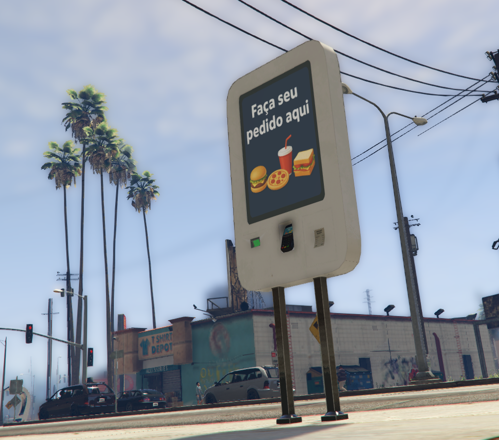

# 📦 mri_Qshop_prop

🌎 Idiomas disponíveis:  
[Inglês](./README.md) | [Português](./README-pt.md)

  

O **mri_Qshop_prop** é um objeto auxiliar desenvolvido para integração com o **sistema MRI Qshop**, oferecendo suporte visual e funcional às interações dentro das lojas virtuais e físicas.  

Ele pode ser utilizado como elemento decorativo ou interativo em ambientes configurados para o Qshop, garantindo maior imersão e realismo na experiência de compra dos jogadores.

---

## 🔑 Principais Características
- Compatível com o sistema **MRI Qshop**  
- Pode ser posicionado em interiores ou exteriores de lojas  
- Suporte a customização visual (skins, texturas ou logos da cidade/empresa)  
- Integrado ao fluxo de compras para aumentar a imersão do roleplay  
- Leve e otimizado para **FiveM**, sem impacto significativo de performance  

---

## 🎯 Usos Comuns
- Balcões de atendimento  
- Displays de produtos  
- Caixas registradoras ou totens de autoatendimento  
- Elementos visuais para destacar pontos de venda  

---

## 🛠️ Créditos
Desenvolvido por **New Age Studios** para utilização no ecossistema MRI Qshop.
