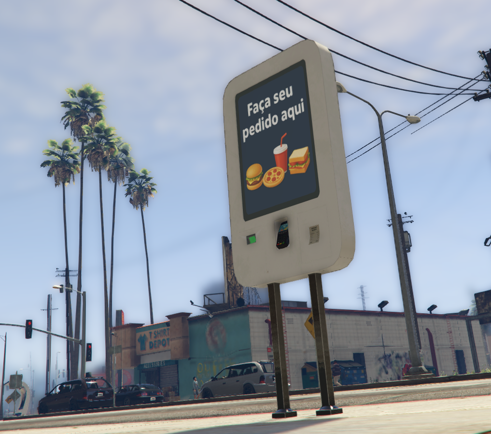

# 📦 mri_Qshop_prop

  

  
  

The **mri_Qshop_prop** is a support prop developed for integration with the **MRI Qshop system**, providing both visual and functional elements for in-game store interactions.  

It can be used as a decorative or interactive asset in environments configured for Qshop, ensuring greater immersion and realism in the players’ shopping experience.

---

## 🔑 Key Features
- Fully compatible with the **MRI Qshop** system  
- Can be placed in indoor or outdoor store environments  
- Supports visual customization (skins, textures, or city/company logos)  
- Integrated into the shopping flow to enhance roleplay immersion  
- Lightweight and optimized for **FiveM**, with no significant performance impact  

---

## 🎯 Common Uses
- Service counters  
- Product displays  
- Cash registers or self-checkout kiosks  
- Visual elements to highlight points of sale  

---

## 🛠️ Credits
Developed by **New Age Studios** for use within the MRI Qshop ecosystem.
